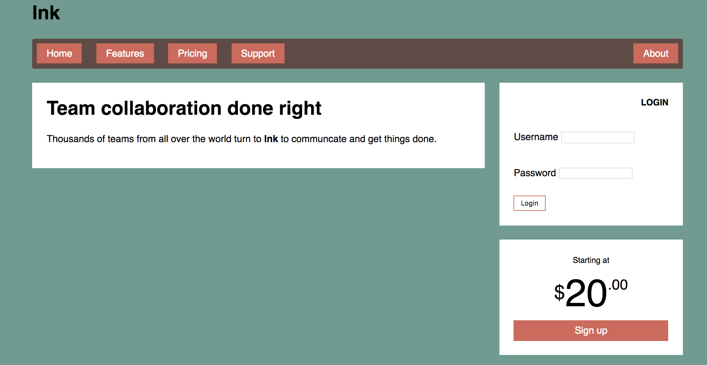

# Grid-Layout-Example
This is based on code from Chapter 6 of 'CSS In Depth' by Keith J. Grant.

It uses grid layout mainly, but flexbox is used for the navigation menu.

The web page produced should look like this:

